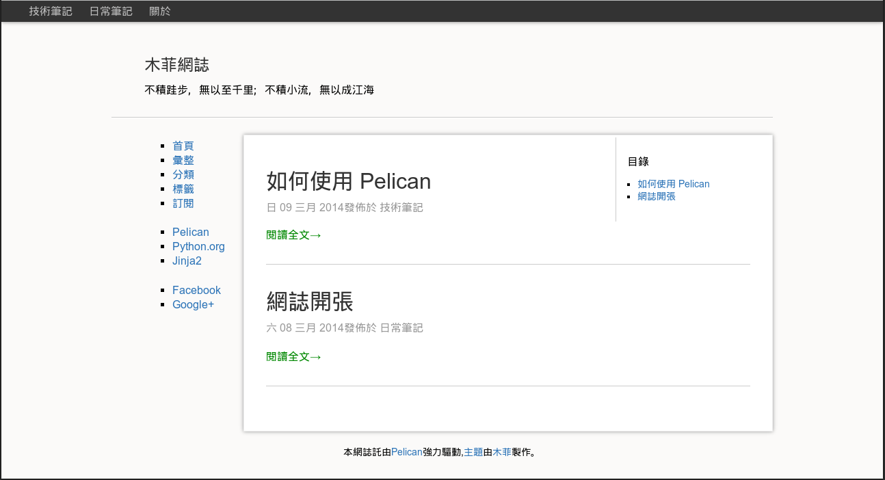

## doku4pelican

----

### 說明

這是一個仿照 [Dokuwiki](http://www.dokuwiki.org) 而製作的 [Pelican](https://github.com/getpelican) 主題。

這也是我做的第一個 Pelican 主題，還不是很完善，請大家多多指教！

### 待完成

- HTML5 音樂掛件
- 文章目錄

### 注意

- 「LINKS」和「SOCIAL」填寫的格式應爲名稱在前，鏈接在後的格式，例如：
> LINKS = (('Pelican'， 'http://getpelican.com/'),)
- 本主題掛件默認顯示「首頁」，「彙整」，「分類」，「標籤」，「訂閱」五項，頂部導航欄默認顯示分類標籤和「關於」頁面。

### 預覽

